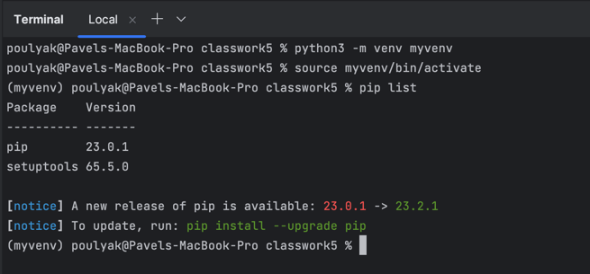
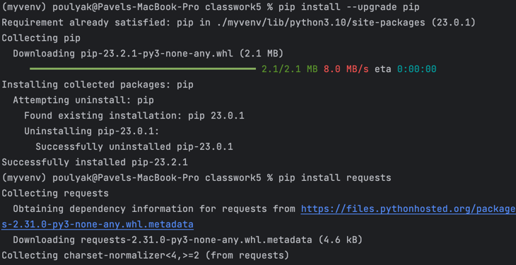
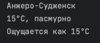

## Практическая работа №5
#### OpenWeatherMap
Зарегистровался на OpenWeatherMap и получил ключ

#### venv
Создал виртуальное окружение myvenv Python при помощи venv:



#### pip
Установил библиотеку requests:



#### Тестируем
Выведите на экран информацию о погоде в заданном формате:




#### Код 
```python
import requests
import json

KEY = '2b5340ff77b707659ea556940c356f66'


def get_weather(city):
    url = f'https://api.openweathermap.org/data/2.5/weather?q={city}&lang=ru&units=metric&APPID={KEY}'

    res = requests.get(url)
    if res.status_code != 200:
        print("Ошибочка какая-то")
        return

    data = json.loads(res.text)

    print(data["name"])
    print(f"{round(data['main']['temp'])}°C, {data['weather'][0]['description']}");
    print(f"Ощущается как {round(data['main']['feels_like'])}°C")


if __name__ == '__main__':
    get_weather("Анжеро-Судженск")

```